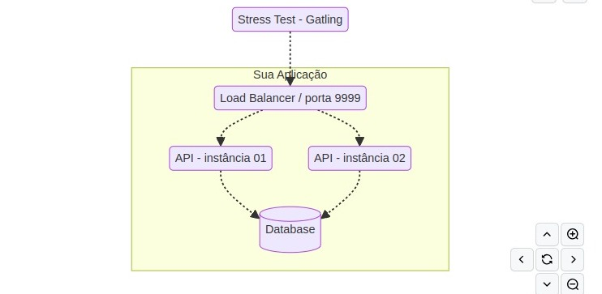

# Rinha Backend - 2025/Q1


 ## Descrição do Projeto

A Rinha de Backend é um competição que tem como principal objetivo compartilhar conhecimento em formato de desafio! 
O principal assunto dessa Rinha trata de controle de concorrência com o tema créditos e débitos (crébitos).

Minha versão foi feita utilizando SpringBoot e PostgreSQL, destinada a simular um sistema bancário oferecendo funcionalidades para realizar transações, depósitos, saques, além de obter extratos com diversos detalhes sobre o financeiro do usuário. O sistema foi desenvolvido para aguentar altas cargas de acesso, em um ambiente de competição que desafia os limites de processamento e gestão de dados sob demanda.


## Tecnologias 
 
- Java 17
- SpringBoot
- PostgreSQL
- Docker/Docker Compose
- Maeven

## Arquitetura do projeto



- Para arquitetura, foi necessário a utilização de um load balancer que faça a distribuição de tráfego usando o algoritimo round robin.
- 2 instâncias de servidores web que atenderão às requisições HTTP (distribuídas pelo load balancer).
- Um banco de dados relacional (PostgreSQL).


### Restrições de CPU/Memória
 
- ```deploy.resources.limits.cpu 1.5``` – uma unidade e meia de CPU distribuída entre todos os seus serviços
- ```deploy.resources.limits.memory``` - 550MB – 550 mega bytes de memória distribuídos entre todos os seus serviços


## Configurações de ambiente
Antes de começar a trabalhar no projeto, é importante configurar o ambiente de desenvolvimento com todas as ferramentas necessárias. Siga os passos abaixo para garantir que tudo esteja configurado corretamente.


Nessa versão eu utilizei o Java SDK 17, então baixe e instale a versão do site oficial da Oracle ou use um gerenciador de pacotes de sua preferência.

### Instalação do Docker 

Para rodar o projeto através do docker e docker compose é necessário ter instalado essas tecnologias em sua máquina, se você não tiver, entre no site oficial https://www.docker.com/ e sigas as instruções para adiquirir os pacotes.


## Executando a aplicação

Esta seção detalha como iniciar a aplicação utilizando Docker para um ambiente isolado e configurado previamente, bem como a execução local para desenvolvimento e testes rápidos.


### Rodando Docker
O uso do Docker simplifica a configuração do ambiente, garantindo que a aplicação execute de forma consistente em qualquer máquina. Siga os passos abaixo para iniciar a aplicação usando Docker Compose.

1. Preparação: Certifique-se de que o Docker e o Docker Compose estejam instalados e funcionando na sua máquina. Consulte a seção Configuração do Ambiente para orientações de instalação.

2. Arquivo Docker Compose: Navegue até o diretório raiz do projeto, onde o arquivo docker-compose.yml está localizado. Este arquivo contém a configuração necessária para executar tanto o aplicativo Spring Boot quanto o serviço PostgreSQL em containers Docker.

3. Iniciar Serviços: Execute o seguinte comando no terminal:

```bash
$ docker-compose up    
```
Se necessário, utilize o sudo antes do comando:
```bash
$ sudo docker-compose up
```
Este comando construirá as imagens Docker necessárias (se ainda não estiverem construídas) e iniciará os containers definidos no docker-compose.yml. A primeira execução pode levar algum tempo, pois precisa baixar as imagens base e construir a imagem da aplicação.

Verificação: Após a conclusão do comando, o load balancer(nginx) estará acessível no endereço http://localhost:9999 (ou na porta configurada no docker-compose.yml).


    
